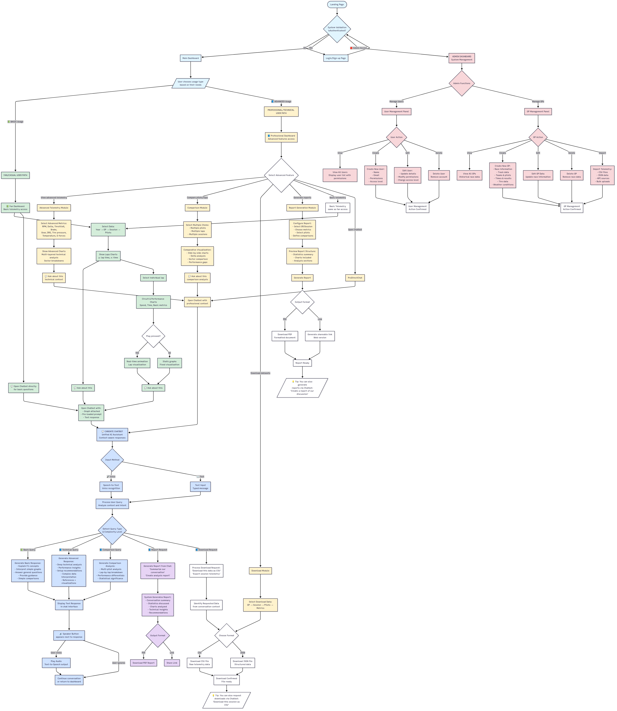

# 🏎️ F1 Telemetry Manager

<div align="center">

**AI-powered Formula 1 telemetry analysis platform with multimodal interaction**

[](LICENSE)
[](https://www.python.org/)
[](https://streamlit.io/)
[](https://fastapi.tiangolo.com/)
[](https://deepwiki.com/VforVitorio/F1_Telemetry_Manager)

[Features](#-features) •
[Architecture](#%EF%B8%8F-architecture) •
[Documentation](#-documentation) •
[Getting Started](#-getting-started) •
[Roadmap](#%EF%B8%8F-roadmap)

</div>

---

## 📋 Overview

**F1 Telemetry Manager** is a comprehensive web application that democratizes Formula 1 telemetry analysis through an intuitive, AI-powered interface. Built with **Streamlit** (frontend) and **FastAPI** (backend), it provides real-time visualization, intelligent analysis, and automated reporting capabilities for F1 enthusiasts and professionals alike.

### 🎯 What It Does

- **📊 Real-time Telemetry Visualization**: Interactive graphs for lap times, speed, throttle, brake pressure, RPM, gear shifts, DRS usage, and more
- **🤖 AI Assistant (Caronte)**: Conversational chatbot powered by LM Studio that provides contextual analysis and insights
- **🎤 Multimodal Input**: Text and voice input support for natural interaction
- **⚖️ Performance Comparison**: Side-by-side analysis of multiple drivers, laps, or sessions with delta visualizations
- **📥 Data Export**: Download raw telemetry data in CSV/JSON formats
- **📄 Automated Reports**: Generate comprehensive PDF reports or shareable links from chat conversations
- **🎬 Circuit Animations**: Visual playback of lap progression with real-time telemetry overlay
- **🔐 User Management**: Feature-based permission system without rigid role hierarchies

---

## ✨ Features

### For Casual Fans 📗

- Simple telemetry visualizations (speed, lap times)
- Interactive circuit animations
- Basic AI-assisted explanations
- Intuitive navigation

### For Technical Users 📘

- Advanced telemetry metrics (RPM, throttle %, brake pressure, tire temperatures, G-forces)
- Multi-layer analysis with sector breakdowns
- Complex driver/lap/session comparisons
- Dataset downloads and custom reports
- Technical AI insights

### AI Assistant 🤖

- **Contextual "Ask about this"** buttons on every visualization
- Voice input/output support
- Conversation history and context awareness
- Adaptive responses based on user expertise level
- Screenshot/context attachment system

### 🧠 Intelligent Query Routing (NEW)

The system now features an **AI-powered query routing architecture** that automatically detects the type of user query and routes it to specialized handlers:

- **Basic Query Handler**: Simple F1 concepts and terminology
- **Technical Query Handler**: Advanced telemetry analysis with performance data
- **Comparison Query Handler**: Multi-driver statistical comparisons
- **Report Handler**: Automated conversation summarization
- **Download Handler**: Data export in CSV/JSON formats

The router uses LLM-based classification to intelligently direct queries, ensuring optimal processing and response quality. See [Testing Guide](TESTING_GUIDE.md) for usage examples.

---

## 🏗️ Architecture

The system follows a **layered architecture** with feature-based organization:

```
┌─────────────────────────────────────────┐
│         USER BROWSER                    │
└──────────────┬──────────────────────────┘
               │
               ↓
┌─────────────────────────────────────────┐
│   STREAMLIT FRONTEND                    │
│   (Presentation Layer)                  │
└──────────────┬──────────────────────────┘
               │ HTTP Requests
               ↓
┌─────────────────────────────────────────┐
│   FASTAPI BACKEND                       │
│   (API + Service + Repository Layers)  │
└────────┬──────────────────┬─────────────┘
         │                  │
         ↓                  ↓
┌──────────────┐    ┌────────────────────┐
│  SUPABASE    │    │  EXTERNAL APIs     │
│  (PostgreSQL)│    │  • FastF1          │
│              │    │  • LM Studio       │
└──────────────┘    └────────────────────┘
```

### Tech Stack

**Frontend:**

- Streamlit 1.31+
- Plotly 5.18+
- Pandas, NumPy
- httpx

**Backend:**

- FastAPI 0.109+
- Pydantic 2.5+
- python-jose (JWT)
- passlib (hashing)
- fastf1 3.2+

**Database:**

- Supabase (PostgreSQL)

**AI/ML:**

- LM Studio (local LLM)

---

## 📚 Documentation

### Core Documents

| Document            | Description                                       | Link                                             |
| ------------------- | ------------------------------------------------- | ------------------------------------------------ |
| **Architecture**    | System design, patterns, and technical decisions  | [📐 ARCHITECTURE.md](docs/ARCHITECTURE.md)       |
| **Roadmap**         | Product roadmap, timeline, and feature plan       | [🗺️ ROADMAP.md](docs/ROADMAP.md)                 |
| **Changelog**       | Version history and notable changes               | [📝 CHANGELOG.md](docs/CHANGELOG.md)             |
| **Issue Templates** | Bug reports, feature requests, and task templates | [🐛 ISSUE_TEMPLATES.md](docs/ISSUE_TEMPLATES.md) |

### Diagrams

<div align="center">

**System Flow Diagram**



_Complete user flow showing authentication, dashboard navigation, telemetry analysis, AI interaction, and admin capabilities_

</div>

---

## 🚀 Getting Started

### Prerequisites

- Docker & Docker Compose
- LM Studio (optional, for AI features)
- Supabase account

### Quick Start with Docker

```bash
# Clone the repository
git clone https://github.com/yourusername/F1_Telemetry_Manager.git
cd F1_Telemetry_Manager

# Set up environment variables
cp .env.example .env
# Edit .env with your Supabase credentials

# Start all services
docker-compose up -d

# View logs
docker-compose logs -f

# Stop services
docker-compose down
```

**Access points:**

- Frontend: http://localhost:8501
- Backend API: http://localhost:8000
- API Documentation: http://localhost:8000/docs

### Manual Installation (without Docker)

```bash
# Install frontend dependencies
cd frontend
pip install -r requirements.txt

# Install backend dependencies
cd ../backend
pip install -r requirements.txt

# Set up environment variables
cp .env.example .env
# Edit .env with your Supabase credentials
```

**Running manually:**

Terminal 1 - Backend:

```bash
uvicorn backend.main:app --reload --port 8000
```

Terminal 2 - Frontend:

```bash
cd frontend
streamlit run frontend/app/main.py
```

Terminal 3 - LM Studio (optional):

```bash
# Start LM Studio on http://localhost:1234
# Load your preferred LLM model
```

---

### Generate Secret Key

Before running the application, generate a secure SECRET_KEY:

```bash
python backend/utils/generate_secret.py
```

Copy the output to your `.env` file.

---

## 🗓️ Roadmap

See the complete [Roadmap](docs/ROADMAP.md) for detailed timeline and feature breakdown.

---

## 🤝 Contributing

Contributions are welcome! Please read our contribution guidelines and submit pull requests for any improvements.

### Reporting Issues

Use our [Issue Templates](docs/ISSUE_TEMPLATES.md) for:

- 🐛 Bug reports
- ✨ Feature requests
- 📊 Data issues
- 🚀 Tasks/TODOs

---

## 📄 License

This project is licensed under the **Apache License 2.0** - see the [LICENSE](LICENSE) file for details.

```
Copyright 2025 F1 Telemetry Manager Contributors

Licensed under the Apache License, Version 2.0 (the "License");
you may not use this file except in compliance with the License.
You may obtain a copy of the License at

    http://www.apache.org/licenses/LICENSE-2.0

Unless required by applicable law or agreed to in writing, software
distributed under the License is distributed on an "AS IS" BASIS,
WITHOUT WARRANTIES OR CONDITIONS OF ANY KIND, either express or implied.
See the License for the specific language governing permissions and
limitations under the License.
```

---

## 🙏 Acknowledgments

- [FastF1](https://github.com/theOehrly/Fast-F1) for F1 telemetry data access
- [Streamlit](https://streamlit.io/) for the frontend framework
- [FastAPI](https://fastapi.tiangolo.com/) for the backend API framework
- [Supabase](https://supabase.com/) for database infrastructure

---

<div align="center">

[Report Bug](https://github.com/yourusername/F1_Telemetry_Manager/issues) •
[Request Feature](https://github.com/yourusername/F1_Telemetry_Manager/issues) •
[Documentation](docs/)

</div>
